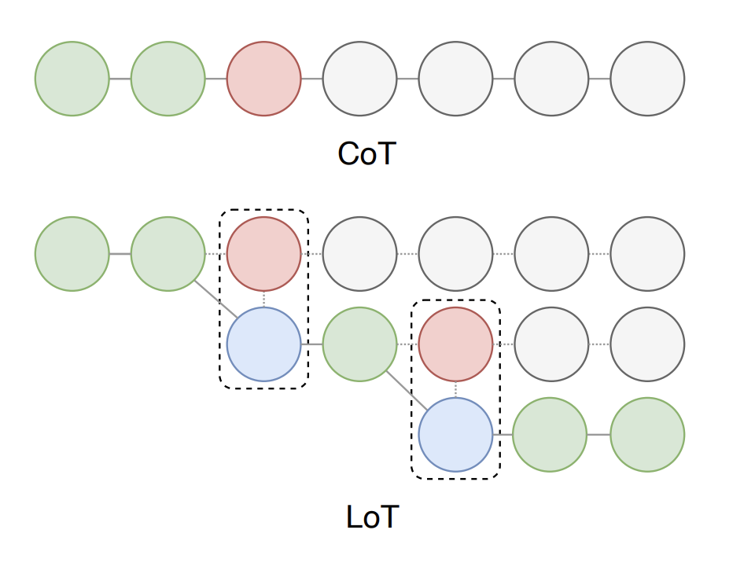
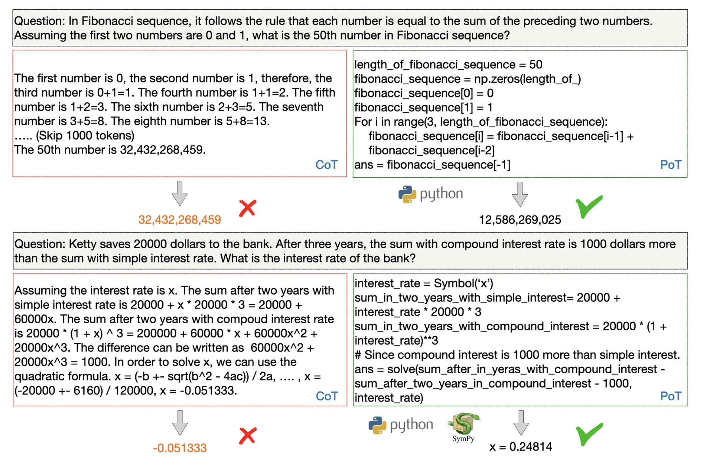

# LLM 技巧总结 | Prompt Engineering 指南

本篇主要介绍在不同场景下 LLM 的各种 Prompt Engineering 技巧，每个都附有论文链接和架构图，方便快速检阅和使用。

## 1. New Tasks Without Extensive Training

### 1.1 Zero-Shot Prompting

Zero-Shot Prompting 是 LLMs 领域的重要创新，由 Radford 等人（2019）提出。这种技术允许我们在没有大规模、专门训练数据的情况下，通过巧妙设计的提示来引导模型进行新任务。

**论文**: [Language Models are Few-Shot Learners](https://arxiv.org/abs/2005.14165) (Radford et al., 2019)

### 1.2 Few-Shot Prompting

Few-Shot Prompting 由 Brown 等人（2020）提出，通过提供少量输入-输出示例帮助模型学习特定任务。

**论文**: [Language Models are Few-Shot Learners](https://arxiv.org/abs/2005.14165) (Brown et al., 2020)

## 2. Reasoning and Logic

### 2.1 Chain-of-Thought (CoT) Prompting LLMs

Wei 等人（2022）提出的 CoT 技术，通过引入特殊的提示策略，促进模型更连续和逐步的思考过程。

**论文**: [Chain-of-Thought Prompting Elicits Reasoning in Large Language Models](https://arxiv.org/abs/2201.11903) (Wei et al., 2022)

### 2.2 Automatic Chain-of-Thought (Auto-CoT) Prompting

Zhang 等人（2022）提出的 Auto-CoT 技术，可以自动生成"逐步思考"的提示，帮助大型语言模型形成推理链。

**论文**: [Automatic Chain of Thought Prompting in Large Language Models](https://arxiv.org/abs/2210.03493) (Zhang et al., 2022)

### 2.3 Self-Consistency

Wang 等人（2022）提出了一种新颖的解码策略，Self-Consistency，通过从语言模型的解码器中提取多条不同的推理路径，生成多种可能的推理链。

**论文**: [Self-Consistency Improves Chain of Thought Reasoning in Language Models](https://arxiv.org/abs/2203.11171) (Wang et al., 2022)

### 2.4 Logical Chain-of-Thought (LogiCoT) Prompting

Zhao 等人（2023）提出的 LogiCoT，引入了一个全新的框架，通过符号逻辑增强推理过程。

**论文**: [Large Language Models as Commonsense Knowledge for Large-Scale Task Planning](https://arxiv.org/abs/2305.14078) (Zhao et al., 2023)

### 2.5 Chain-of-Symbol (CoS) Prompting

Hu 等人（2023）提出的 CoS 方法，选择使用简化符号作为提示，而不是自然语言。

**论文**: [Chain-of-Symbol Prompting Elicits Planning in Large Language Models](https://arxiv.org/abs/2305.10266) (Hu et al., 2023)

### 2.6 Tree-of-Thoughts (ToT) Prompting

Yao 等人（2023）和 Long（2023）提出的 ToT，创建了一个树状结构的中间推理步骤，称为"思考"。

**论文**: [Tree of Thoughts: Deliberate Problem Solving with Large Language Models](https://arxiv.org/abs/2305.10601) (Yao et al., 2023)

### 2.7 Graph-of-Thoughts (GoT) Prompting

Yao 等人（2023）提出的 GoT 方法，通过构建思维导图模拟人脑的非线性思维模式。

**论文**: [Graph of Thoughts: Solving Elaborate Problems with Large Language Models](https://arxiv.org/abs/2308.09687) (Yao et al., 2023)

### 2.8 System 2 Attention (S2A) Prompting

Weston 和 Sukhbaatar（2023）提出的 S2A 方法，重构输入的上下文，以提高信息处理质量和响应的相关性。

**论文**: [System 2 Attention (S2A)](https://arxiv.org/abs/2311.11829) (Weston and Sukhbaatar, 2023)

### 2.9 Thread of Thought (ThoT) Prompting

Zhou 等人（2023）提出的 ThoT 技术，模仿人类的思维过程，通过将复杂情况分解为更小、更易管理的部分进行分析。

**论文**: [Thread of Thought: Enabling Large Language Models to Think with Steps, Situations and More](https://arxiv.org/abs/2305.19572) (Zhou et al., 2023)

### 2.10 Chain-of-Table Prompting

Wang 等人（2024）开发的 Chain-of-Table 提示方法，通过对表执行逐步的 SQL/DataFrame 操作，实施动态的表推理过程。

**论文**: [Chain-of-Table: Evolving Tables in the Reasoning Chain for Table Understanding](https://arxiv.org/abs/2401.04398) (Wang et al., 2024)

## 3. Reduce Hallucination

### 3.1 Retrieval Augmented Generation (RAG)

Lewis 等人（2020）提出的 RAG 方法，通过将信息检索技术无缝集成到提示过程中，提供了一种全新的解决方案。

**论文**: [Retrieval-Augmented Generation for Knowledge-Intensive NLP Tasks](https://arxiv.org/abs/2005.11401) (Lewis et al., 2020)

### 3.2 ReAct Prompting

Yao 等人（2022）提出的 ReAct 技术，使 LLMs 能够在生成推理的同时采取行动。

**论文**: [ReAct: Synergizing Reasoning and Acting in Language Models](https://arxiv.org/abs/2210.03629) (Yao et al., 2022)

### 3.3 Chain-of-Verification (CoVe) Prompting

Dhuliawala 等人（2023）提出的 CoVe 方法，通过模拟人类验证的思维过程，提高了大语言模型输出的一致性和准确性。

**论文**: [Chain-of-Verification Reduces Hallucination in Large Language Models](https://arxiv.org/abs/2309.11495) (Dhuliawala et al., 2023)

## 4. User Interface

### 4.1 Active Prompting

Diao 等人（2023）开发的 Active Prompting，通过引入任务特定的示例提示和编码，提高模型在复杂问答中的表现。

**论文**: [Active Prompting with Chain-of-Thought for Large Language Models](https://arxiv.org/abs/2302.12246) (Diao et al., 2023)

## 5. Fine-Tuning and Optimization

### 5.1 Automatic Prompt Engineer (APE)

Zhou 等人（2022）提出的 APE 技术，动态生成和选择最有效的提示，突破了手动和固定提示的限制。

**论文**: [Large Language Models Are Human-Level Prompt Engineers](https://arxiv.org/abs/2211.01910) (Zhou et al., 2022)

## 6. Knowledge-Based Reasoning and Generation

### 6.1 Automatic Reasoning and Tool-use (ART)

Paranjape 等人（2023）提出的 ART 技术，通过多步骤过程和外部知识的无缝集成，弥补了推理能力的不足。

**论文**: [ART: Automatic multi-step reasoning and tool-use for large language models](https://arxiv.org/abs/2303.09014) (Paranjape et al., 2023)

## 7. Improving Consistency and Coherence

### 7.1 Contrastive Chain-of-Thought (CCoT) Prompting

Chia 等人（2023）提出的 CCoT 技术，通过提供正确和错误推理的示例，引导模型进行逐步推理。

**论文**: [Contrastive Chain-of-Thought Prompting](https://arxiv.org/abs/2311.09277) (Chia et al., 2023)

## 8. Managing Emotions and Tone

### 8.1 Emotion Prompting

Li 等人（2023）提出的 EmotionPrompt 技术，通过在提示中添加情感激励句子，旨在增强 LLMs 的情感智能。

**论文**: [EmotionPrompt: Leveraging Psychology for Large Language Models via Emotional Stimulus](https://arxiv.org/abs/2307.11010) (Li et al., 2023)

## 9. Code Generation and Execution

### 9.1 Scratchpad Prompting

Nye 等人（2021）提出的 Scratchpad Prompting 方法，允许模型在给出最终答案之前生成一系列中间步骤。

**论文**: [Show Your Work: Scratchpads for Intermediate Computation with Language Models](https://arxiv.org/abs/2112.00114) (Nye et al., 2021)

### 9.2 Program of Thoughts (PoT) Prompting

Chen 等人（2022）提出的 PoT，通过鼓励使用外部语言解释器处理计算步骤，增强 LLMs 的数值推理能力。

**论文**: [Program of Thoughts Prompting: Disentangling Computation from Reasoning for Numerical Reasoning Tasks](https://arxiv.org/abs/2211.12588) (Chen et al., 2022)

### 9.3 Structured Chain-of-Thought (SCoT) Prompting

Li 等人（2023）提出的 SCoT，通过将程序结构融入推理步骤，显著提高了 LLMs 生成结构化源代码的能力。

**论文**: [Structured Chain-of-Thought Prompting for Code Generation](https://arxiv.org/abs/2305.06599) (Li et al., 2023)

### 9.4 Chain-of-Code (CoC) Prompting

Li 等人（2023）提出的 CoC 技术，通过编程增强模型在逻辑和语义任务上的推理能力。

**论文**: [Chain-of-Code: Reasoning with a Language Model-Augmented Code Emulator](https://arxiv.org/abs/2312.04511) (Li et al., 2023)

## 10. Optimization and Efficiency

### 10.1 Optimization by Prompting (OPRO)

Yang 等人（2023）提出的 OPRO 方法，使用 LLMs 来帮助寻找解决方案。

**论文**: [Optimization by PROmpting (OPRO)](https://arxiv.org/abs/2309.03409) (Yang et al., 2023)

## 11. Understanding User Intent

### 11.1 Rephrase and Respond (RaR) Prompting

Deng 等人（2023）提出的 RaR 方法，允许 LLM 重新措辞和扩展提示中的问题，以提高理解和回答的准确性。

**论文**: [Rephrase and Respond: Let Large Language Models Ask Better Questions for Themselves](https://arxiv.org/abs/2311.04205) (Deng et al., 2023)

## 12. Metacognition and Self-Reflection

### 12.1 Take a Step Back Prompting

Zheng 等人（2023）提出的 Take a Step Back Prompting，允许模型进行高层次抽象思维，从具体案例中提取基本原理和高层次概念。

**论文**: [Take a Step Back: Evoking Reasoning via Abstraction in Large Language Models](https://arxiv.org/abs/2310.06117) (Zheng et al., 2023)

